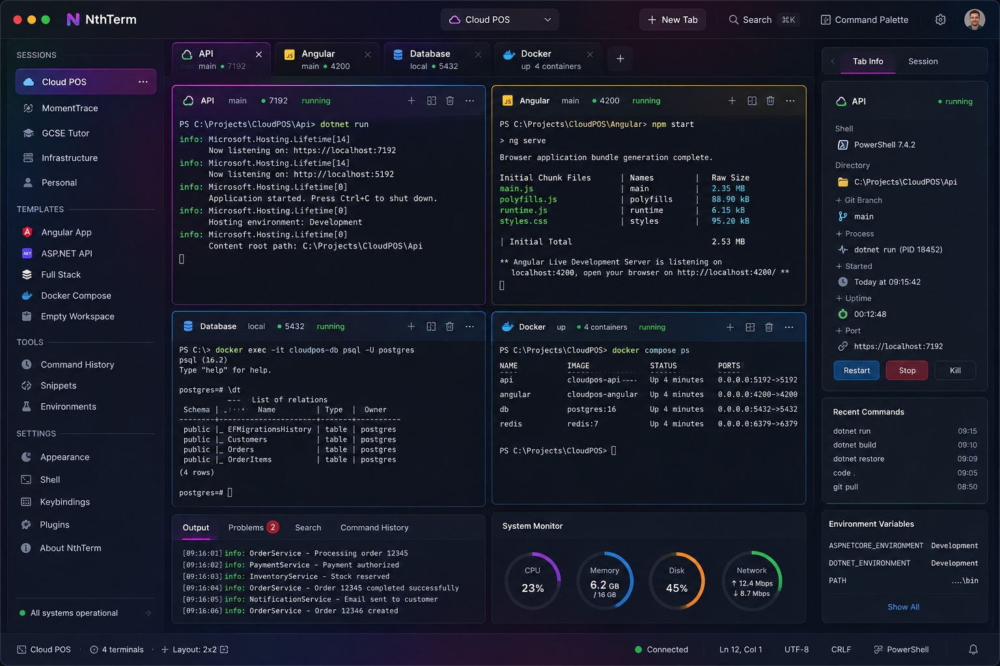

# NthTerm

NthTerm is a cross-platform terminal workspace manager built with Angular, Electron, xterm.js, node-pty, and SQLite.

The goal is to make it easy to create, save, restore, and manage rich terminal workspaces with multiple tabs, pane layouts, startup context, and session-aware tooling.

## Product direction

NthTerm is headed toward a rich desktop workspace experience for developers and operators:

- named workspaces and starter templates
- multiple tabs and split panes
- session-aware terminal cards with status and quick actions
- right-side inspectors for tab and session metadata
- bottom utility panels for output, problems, search, and command history
- workspace telemetry such as system monitor and environment details
- command palette and global workspace search

### Target UI reference



## Current status

Current milestone: **Phase 3 complete** — multi-tab workspace shell with launch restore and session preferences.

Working today:

- Electron opens and renders a real interactive terminal
- PTY lifecycle is managed in Electron main through `node-pty`
- workspace state is stored in SQLite through an Electron-managed persistence layer
- multiple named workspaces and starter templates
- each workspace persists tabs, layout mode, focused pane, and pane-to-tab assignments
- `2-up` and `2x2` pane layouts with focused-pane terminal restore
- tab and session inspector with live PTY metadata and restart/stop/kill actions
- bottom utility panels: output, problems, search, and command history
- system monitor (CPU, memory, disk, network) and session environment variables
- command palette and global workspace search
- last workspace auto-restores on launch, with invalid directory fallback
- per-tab shell preference and startup commands persisted in SQLite

Keyboard shortcuts:

- `Ctrl+Shift+P` — command palette
- `Ctrl+Shift+F` — global workspace search

Next up (Phase 4):

- workspace rename/delete flows
- session history and richer recovery metadata
- deeper multi-pane runtime behavior beyond the current focused-pane model

## Quick start

Install dependencies:

```bash
npm install
```

Run Angular and Electron together for local development:

```bash
npm start
```

Build the Angular app:

```bash
npm run build
```

Launch Electron against the production build:

```bash
npm run desktop
```

## Notes

The persistence layer stores restore-oriented workspace metadata, including:

- workspace identity and working directory
- template and visual metadata
- launch profile and layout mode
- tab snapshot data (cwd, shell, startup commands, status)
- focused pane and pane assignments

The split-pane shell currently restores one live interactive terminal into the focused pane while the other assigned panes show saved tab context. This keeps PTY ownership simple in Electron main for now and gives the project a clean path toward true concurrent pane sessions later.

On launch, the app restores the last active workspace from SQLite. Invalid saved directories fall back to the user home directory so PTY creation does not fail on missing paths.

## Architecture direction

- Angular handles rendering and user interaction.
- Electron main owns PTY and process management.
- xterm.js provides the terminal UI.
- SQLite persistence runs in Electron main and is exposed through the preload bridge.
- The active workspace and workspace list are managed in Electron main and projected into the sidebar through the preload bridge.
- System metrics and session environment variables are served through a dedicated preload bridge.
- Workspace records include restore metadata so the shell can grow into deeper tab and split-pane restoration without redesigning persistence later.
- Terminal tab actions update the workspace snapshot directly.
- Pane layout restoration currently uses a focused-pane model: Angular renders the workspace grid and saved pane assignments, while Electron still owns the single active PTY session lifecycle.
